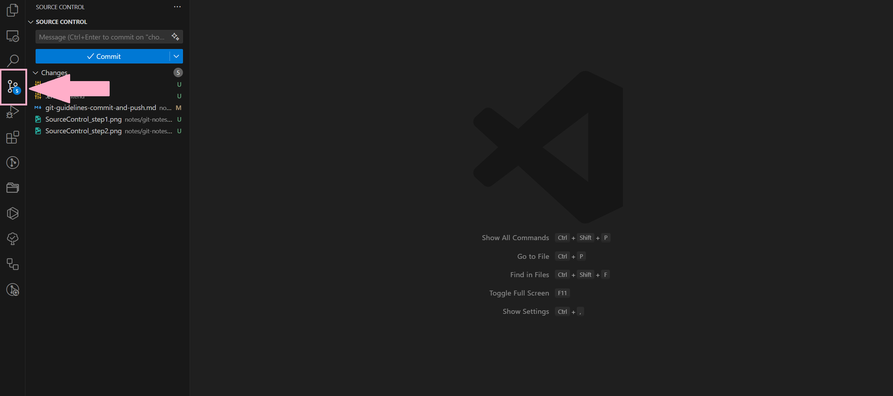
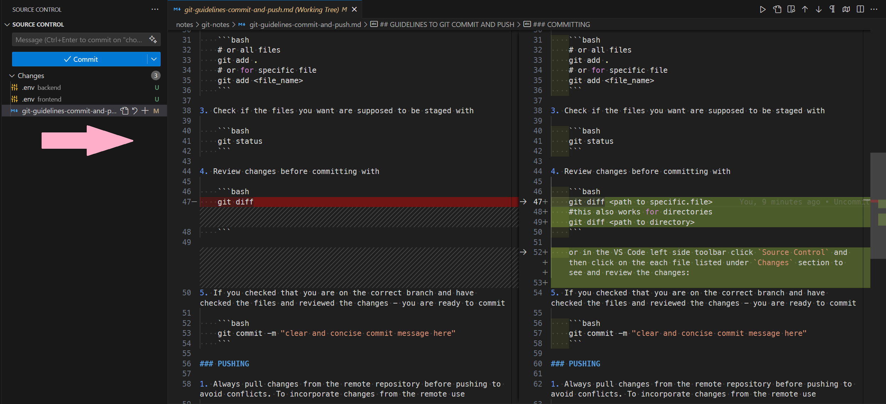
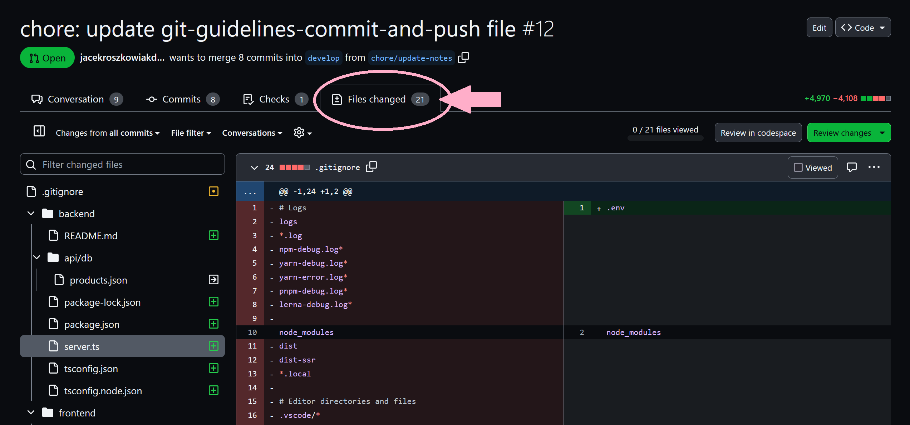

## GUIDELINES TO GIT COMMIT AND PUSH

Committing and pushing changes in Git involve several best practices to ensure a clean and organized version history. The convention rules for creating explicit commit history can be found on [ConventionalCommits](https://www.conventionalcommits.org/en/v1.0.0/) webpage.

Follow the below collection of advices to keep your commits and changes well organized and readable for others.

### COMMITS GOOD PRACTICES

-   Atomic Commits:
    Make each commit a logically cohesive and atomic unit. It should represent a single, focused change. This makes it easier to understand the history and revert changes if needed.

-   Clear and Concise Commit Messages:
    Write clear and concise commit messages that describe the purpose of the change. Follow a format like: "Short (50 chars or less) summary of changes\n\nMore detailed explanatory text, if necessary."

-   Use Imperative Mood:
    Write commit messages in the imperative mood (e.g., "Add feature" instead of "Added feature"). This provides a consistent and readable history.

-   Avoid Committing Unrelated Changes:
    Keep changes in a single commit related. If you have unrelated changes, consider committing them separately.

### COMMITTING

1. Always check if you are in the right branch

```bash
    git branch
```

2. Add files

```bash
    # or all files
    git add .
    # or for specific file
    git add <file_name>
```

3. Check if the files you want are supposed to be staged with

```bash
    git status
```

4. Review changes before committing with

```bash
    git diff <path to specific_file>
    # this also works for directories
    git diff <path to directory>
```

Alternatively in the VS Code left side toolbar click `Source Control` as shown below:



and then click on the each file listed under `Changes` section to see and review the changes:



5. If you checked that you are on the correct branch and have checked the files and reviewed the changes - you are ready to commit

```bash
    git commit -m "clear and concise commit message here"
```

### PUSHING

1. Always pull changes from the remote repository before pushing to avoid conflicts. To incorporate changes from the remote use

```bash
    git pull
```

2. All steps and checks done? Then it is OK to `git push`. If it is your first push from the new brach then you need to add the remote repository and upstream with the following command

    ```bash
    git push --set-upstream origin
    # otherwise, your next push can be done with just
    git push
    ```

3. Lastly got to Github and check the `Files changed` tab if the changes are exactly what you expect:

    
